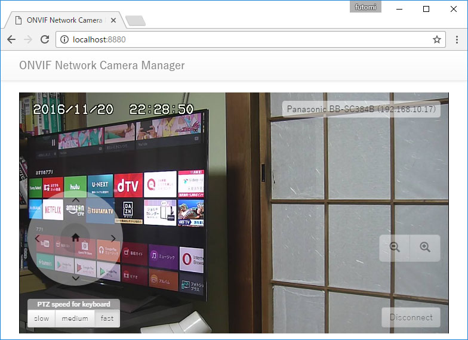

node-onvif
===============

The node-onvif is a Node.js module which allows you to communicate with the network camera which supports the ONVIF specifications.

The [ONVIF](http://www.onvif.org/) (Open Network Video Interface) is an open industry forum promoting and developing global standards for interfaces of IP-based physical security products such as network cameras. The ONVIF specifications are available in [their web site](http://www.onvif.org/Documents/Specifications.aspx).

Recently, most of network cameras for business support the ONVIF standard. Furthermore, some network cameras for home support it though the implementation is partial. The node-onvif allows you to control network cameras which implement the ONVIF standard.

The node-onvif provides you with the APIs as follows:

* Discovery the ONVIF network cameras
* Access some services supported by the ONVIF network cameras as follows:
  * Device Management Service
  * Media Service
  * PTZ Service

Besides, the node-onvif provides you with simple APIs that allow you to control ONVIF network cameras easily even if you are not familiar with the ONVIF specifications.

## Installation

```
$ npm install -s node-onvif
```

## Sample Application

This package includes a sample application "[ONVIF Network Camera Manager](https://github.com/futomi/node-onvif/tree/master/sample)". You can try this module with your PTZ ONVIF network camera easily.



---------------------------------------
## Table of Contents
* [Quick Start](#Quick-Start)
  * [Discover ONVIF network cameras](#Quick-Start-1)
  * [Create an OnvifDevice object](#Quick-Start-2)
  * [Get the stream URL](#Quick-Start-3)
  * [Get the snapshot](#Quick-Start-4)
  * [Control the PTZ](#Quick-Start-5)
* [Asynchronous methods](#Asynchronous-methods)
* [`Onvif` object](#Onvif-object)
  * [Create an `Onvif` object](#Create-an-Onvif-object)
  * [Methods](#Onvif-methods)
    * [`startProbe([callback])` method](#startProbe-method)
    * [`stopProbe([callback])` method](#stopProbe-method)
    * [`startDiscovery(callback)` method](#startDiscovery-method) *(deprecated)*
    * [`stopDiscovery([callback])` method](#stopDiscovery-method) *(deprecated)*
* [`OnvifDevice` object](#OnvifDevice-object)
  * [Create an `OnvifDevice` object](#Create-an-OnvifDevice-object)
  * [Properties](#OnvifDevice-properties)
  * [Methods](#OnvifDevice-methods)
    * [`init([callback])` method](#OnvifDevice-init-method)
    * [`getInformation()` method](#OnvifDevice-getInformation-method)
    * [`getCurrentProfile()` method](#OnvifDevice-getCurrentProfile-method)
    * [`getProfileList()` method](#OnvifDevice-getProfileList-method)
    * [`changeProfile(index|token)` method](#OnvifDevice-changeProfile-method)
    * [`getUdpStreamUrl()` method](#OnvifDevice-getUdpStreamUrl-method)
    * [`fetchSnapshot(callback)` method](#OnvifDevice-fetchSnapshot-method)
    * [`ptzMove(params[, callback])` method](#OnvifDevice-ptzMove-method)
    * [`ptzStop([callback])` method](#OnvifDevice-ptzStop-method)
* [ONVIF commands](#ONVIF-commands)
* [`OnvifServiceDevice` object](#OnvifServiceDevice-object)
  * [`getCapabilities([callback])` method](#OnvifServiceDevice-getCapabilities-method)
  * [`getWsdlUrl([callback])` method](#OnvifServiceDevice-getWsdlUrl-method)
  * [`getDiscoveryMode([callback])` method](#OnvifServiceDevice-getDiscoveryMode-method)
  * [`getScopes([callback])` method](#OnvifServiceDevice-getScopes-method)
  * [`setScopes(params[, callback])` method](#OnvifServiceDevice-setScopes-method)
  * [`addScopes(params[, callback])` method](#OnvifServiceDevice-addScopes-method)
  * [`removeScopes(params[, callback])` method](#OnvifServiceDevice-removeScopes-method)
  * [`getHostname([callback])` method](#OnvifServiceDevice-getHostname-method)
  * [`setHostname(params[, callback])` method](#OnvifServiceDevice-setHostname-method)
  * [`getDNS([callback])` method](#OnvifServiceDevice-getDNS-method)
  * [`setDNS(params[, callback])` method](#OnvifServiceDevice-setDNS-method)
  * [`getNetworkInterfaces([callback])` method](#OnvifServiceDevice-getNetworkInterfaces-method)
  * [`getNetworkProtocols([callback])` method](#OnvifServiceDevice-getNetworkProtocols-method)
  * [`setNetworkProtocols(params[, callback])` method](#OnvifServiceDevice-setNetworkProtocols-method)
  * [`getNetworkDefaultGateway([callback])` method](#OnvifServiceDevice-getNetworkDefaultGateway-method)
  * [`setNetworkDefaultGateway(params[, callback])` method](#OnvifServiceDevice-setNetworkDefaultGateway-method)
  * [`getDeviceInformation([callback])` method](#OnvifServiceDevice-getDeviceInformation-method)
  * [`getSystemDateAndTime([callback])` method](#OnvifServiceDevice-getSystemDateAndTime-method)
  * [`reboot([callback])` method](#OnvifServiceDevice-reboot-method)
  * [`getUsers([callback])` method](#OnvifServiceDevice-getUsers-method)
  * [`createUsers(params[, callback])` method](#OnvifServiceDevice-createUsers-method)
  * [`deleteUsers(params[, callback])` method](#OnvifServiceDevice-deleteUsers-method)
  * [`setUser(params[, callback])` method](#OnvifServiceDevice-setUser-method)
  * [`getRelayOutputs([callback])` method](#OnvifServiceDevice-getRelayOutputs-method)
  * [`getNTP([callback])` method](#OnvifServiceDevice-getNTP-method)
  * [`setNTP(params[, callback])` method](#OnvifServiceDevice-setNTP-method)
  * [`getDynamicDNS([callback])` method](#OnvifServiceDevice-getDynamicDNS-method)
  * [`getZeroConfiguration([callback])` method](#OnvifServiceDevice-getZeroConfiguration-method)
  * [`getServices(params[, callback])` method](#OnvifServiceDevice-getServices-method)
  * [`getServiceCapabilities([callback])` method](#OnvifServiceDevice-getServiceCapabilities-method)
* [`OnvifServiceMedia` object](#OnvifServiceMedia-object)
  * [`getStreamUri(params[, callback])` method](#OnvifServiceMedia-getStreamUri-method)
  * [`getVideoEncoderConfigurations([callback])` method](#OnvifServiceMedia-getVideoEncoderConfigurations-method)
  * [`getVideoEncoderConfiguration(params[, callback])` method](#OnvifServiceMedia-getVideoEncoderConfiguration-method)
  * [`getCompatibleVideoEncoderConfigurations(params[, callback])` method](#OnvifServiceMedia-getCompatibleVideoEncoderConfigurations-method)
  * [`getVideoEncoderConfigurationOptions(params[, callback])` method](#OnvifServiceMedia-getVideoEncoderConfigurationOptions-method)
  * [`getGuaranteedNumberOfVideoEncoderInstances(params[, callback])` method](#OnvifServiceMedia-getGuaranteedNumberOfVideoEncoderInstances-method)
  * [`getProfiles([callback])` method](#OnvifServiceMedia-getProfiles-method)
  * [`getProfile(params[, callback])` method](#OnvifServiceMedia-getProfile-method)
  * [`createProfile(params[, callback])` method](#OnvifServiceMedia-createProfile-method)
  * [`deleteProfile(params[, callback])` method](#OnvifServiceMedia-deleteProfile-method)
  * [`getVideoSources([callback])` method](#OnvifServiceMedia-getVideoSources-method)
  * [`getVideoSourceConfiguration(params[, callback])` method](#OnvifServiceMedia-getVideoSourceConfiguration-method)
  * [`getVideoSourceConfigurations([callback])` method](#OnvifServiceMedia-getVideoSourceConfigurations-method)
  * [`getCompatibleVideoSourceConfigurations(params[, callback])` method](#OnvifServiceMedia-getCompatibleVideoSourceConfigurations-method)
  * [`getVideoSourceConfigurationOptions(params[, callback])` method](#OnvifServiceMedia-getVideoSourceConfigurationOptions-method)
  * [`getMetadataConfiguration(params[, callback])` method](#OnvifServiceMedia-getMetadataConfiguration-method)
  * [`getMetadataConfigurations([callback])` method](#OnvifServiceMedia-getMetadataConfigurations-method)
  * [`getCompatibleMetadataConfigurations(params[, callback])` method](#OnvifServiceMedia-getCompatibleMetadataConfigurations-method)
  * [`getMetadataConfigurationOptions(params[, callback])` method](#OnvifServiceMedia-getMetadataConfigurationOptions-method)
  * [`getAudioSources([callback])` method](#OnvifServiceMedia-getAudioSources-method)
  * [`getAudioSourceConfiguration(params[, callback])` method](#OnvifServiceMedia-getAudioSourceConfiguration-method)
  * [`getAudioSourceConfigurations([callback])` method](#OnvifServiceMedia-getAudioSourceConfigurations-method)
  * [`getCompatibleAudioSourceConfigurations(params[, callback])` method](#OnvifServiceMedia-getCompatibleAudioSourceConfigurations-method)
  * [`getAudioSourceConfigurationOptions(params[, callback])` method](#OnvifServiceMedia-getAudioSourceConfigurationOptions-method)
  * [`getAudioEncoderConfiguration(params[, callback])` method](#OnvifServiceMedia-getAudioEncoderConfiguration-method)
  * [`getAudioEncoderConfigurations([callback])` method](#OnvifServiceMedia-getAudioEncoderConfigurations-method)
  * [`getCompatibleAudioEncoderConfigurations(params[, callback])` method](#OnvifServiceMedia-getCompatibleAudioEncoderConfigurations-method)
  * [`getAudioEncoderConfigurationOptions(params[, callback])` method](#OnvifServiceMedia-getAudioEncoderConfigurationOptions-method)
  * [`getSnapshotUri(params[, callback])` method](#OnvifServiceMedia-getSnapshotUri-method)
* [`OnvifServicePtz` object](#OnvifServicePtz-object)
  * [`getNodes([callback])` method](#OnvifServicePtz-getNodes-method)
  * [`getNode(params[, callback])` method](#OnvifServicePtz-getNode-method)
  * [`getConfigurations([callback])` method](#OnvifServicePtz-getConfigurations-method)
  * [`getConfiguration(params[, callback])` method](#OnvifServicePtz-getConfiguration-method)
  * [`getConfigurationOptions(params[, callback])` method](#OnvifServicePtz-getConfigurationOptions-method)
  * [`getStatus(params[, callback])` method](#OnvifServicePtz-getStatus-method)
  * [`continuousMove(params[, callback])` method](#OnvifServicePtz-continuousMove-method)
  * [`absoluteMove(params[, callback])` method](#OnvifServicePtz-absoluteMove-method)
  * [`relativeMove(params[, callback])` method](#OnvifServicePtz-relativeMove-method)
  * [`stop(params[, callback])` method](#OnvifServicePtz-stop-method)
  * [`gotoHomePosition(params[, callback])` method](#OnvifServicePtz-gotoHomePosition-method)
  * [`setHomePosition(params[, callback])` method](#OnvifServicePtz-setHomePosition-method)
  * [`setPreset(params[, callback])` method](#OnvifServicePtz-setPreset-method)
  * [`getPresets(params[, callback])` method](#OnvifServicePtz-getPresets-method)
  * [`gotoPreset(params[, callback])` method](#OnvifServicePtz-gotoPreset-method)
  * [`removePreset(params[, callback])` method](#OnvifServicePtz-removePreset-method)
* [References](#References)
* [Release Note](#Release-Note)
* [License](#License)

---------------------------------------
## <a id="Quick-Start">Quick Start</a>

This section shows how to discover ONVIF network cameras, how to get the device information, and how to control the PTZ of the device.

### <a id="Quick-Start-1">Discover ONVIF network cameras</a>

This sample code shows how to discover ONVIF network cameras.

```JavaScript
const onvif = require('node-onvif');

console.log('Start the discovery process.');
// Find the ONVIF network cameras.
// It will take about 3 seconds.
onvif.startProbe().then((device_info_list) => {
  console.log(device_info_list.length + ' devices were found.');
  // Show the device name and the URL of the end point.
  device_info_list.forEach((info) => {
    console.log('- ' + info.urn);
    console.log('  - ' + info.name);
    console.log('  - ' + info.xaddrs[0]);
  });
}).catch((error) => {
  console.error(error);
});
```

The code above will output the result like this:

```
Start the discovery process.
5 devices were found.
- urn:uuid:cd279d60-afd3-3a22-00dc-daaa234e772c
  - Canon VB-S30D
  - http://192.168.10.10:80/onvif/device_service
- urn:uuid:13814000-8752-1052-bfff-045d4b150782
  - Sony
  - http://192.168.10.14/onvif/device_service
- urn:uuid:4d454930-0000-1000-8000-bcc34217e292
  - Panasonic BB-SC384B
  - http://192.168.10.12/onvif/device_service
- urn:uuid:00030050-0000-1000-8000-104fa8e2cc96
  - Sony
  - http://192.168.10.25/onvif/device_service
- urn:uuid:8b10a2e0-3302-48df-9d1a-1197c360e6ca
  - Avantgarde-Test
  - http://192.168.10.27:36000/onvif/device_service
```

The most important information for controlling the device is the URL of the end point of the device. You can get the URL from the code `info.xaddrs[0]` above.

### <a id="Quick-Start-2">Create an `OnvifDevice` object</a>

In order to control the ONVIF network camera, you have to create an `OnfivDevice` object for the device, then initialize the object using the `init()` method. This sample code shows how to create an `OnvifDevice` object and get the detailed information of the device. 

```JavaScript
const onvif = require('node-onvif');

// Create an OnvifDevice object
let device = new onvif.OnvifDevice({
  xaddr: 'http://192.168.10.10:80/onvif/device_service',
  user : 'admin',
  pass : '123456'
});

// Initialize the OnvifDevice object
device.init().then((info) => {
  // Show the detailed information of the device.
  console.log(JSON.stringify(info, null, '  '));
}).catch((error) => {
  console.error(error);
});
```

The code above will output the result like this:

```
{
  "Manufacturer": "Canon",
  "Model": "VB-S30D",
  "FirmwareVersion": "Ver. 1.3.3",
  "SerialNumber": "999999999999",
  "HardwareId": "1D"
}
```

### <a id="Quick-Start-3">Get the stream URL</a>

This sample code shows how to get the UDP stream URL.

```JavaScript
const onvif = require('node-onvif');

// Create an OnvifDevice object
let device = new onvif.OnvifDevice({
  xaddr: 'http://192.168.10.14:10080/onvif/device_service',
  user : 'admin',
  pass : '123456'
});

// Initialize the OnvifDevice object
device.init().then(() => {
  // Get the UDP stream URL
  let url = device.getUdpStreamUrl();
  console.log(url);
}).catch((error) => {
  console.error(error);
});
```

The code above will output the result like this:

```
rtsp://192.168.10.14:10554/tcp/av0_0
```

### <a id="Quick-Start-4">Get the snapshot</a>

This sample code shows how to get the data of the snapshot and save it to a file.

```JavaScript
const onvif = require('node-onvif');
const fs = require('fs');

// Create an OnvifDevice object
let device = new onvif.OnvifDevice({
  xaddr: 'http://192.168.10.14:10080/onvif/device_service',
  user : 'admin',
  pass : '123456'
});

// Initialize the OnvifDevice object
device.init().then(() => {
  // Get the data of the snapshot
  console.log('fetching the data of the snapshot...');
  return device.fetchSnapshot();
}).then((res) => {
  // Save the data to a file
  fs.writeFileSync('snapshot.jpg', res.body, {encoding: 'binary'});
  console.log('Done!');
}).catch((error) => {
  console.error(error);
});
```

The code above will output the result like this:

```
fetching the data of the snapshot...
Done!
```

You will find a JPEG file named `snapshot.jpg` in the current directory.

### <a id="Quick-Start-5">Control the PTZ</a>

This sample code shows how to pan, tilt, and zoom the ONVIF network camera.

```JavaScript
const onvif = require('node-onvif');

// Create an OnvifDevice object
let device = new onvif.OnvifDevice({
  xaddr: 'http://192.168.10.14:10080/onvif/device_service',
  user : 'admin',
  pass : '123456'
});

// Initialize the OnvifDevice object
device.init().then(() => {
  // Move the camera
  return device.ptzMove({
    'speed': {
      x: 1.0, // Speed of pan (in the range of -1.0 to 1.0)
      y: 0.0, // Speed of tilt (in the range of -1.0 to 1.0)
      z: 0.0  // Speed of zoom (in the range of -1.0 to 1.0)
    },
    'timeout': 1 // seconds
  });
}).then(() => {
  console.log('Done!');
}).catch((error) => {
  console.error(error);
});
```

If this code has been successfully finished, you could find that the camera turns to the right for a second at the highest speed.

---------------------------------------
## <a id="Asynchronous-methods">Asynchronous methods</a>

Asynchronous methods implemented in this module return a `Promise` object. In the other hand, such methods support callback coding style as well.

```JavaScript
device.fetchSnapshot().then((res) => {
  // Do something
}).catch((error) => {
  console.error(error); 
});
```

```JavaScript
device.fetchSnapshot((error, res) => {
  if(error) {
    console.error(error);
  } else {
    // Do something
  }
});
```

Though the results of the codes above will be completely same, it is strongly recommended to use the `Promise` style. The callback style will be deprecated in the future.

The callback style remains only for backward compatibility becase the versions earlier than v0.1.0 supported only the callback style.

---------------------------------------
## <a id="Onvif-object">Onvif object</a>

### <a id="Create-an-Onvif-object">Create an `Onvif` object</a>

In order to use the node-onvif module, you have to load the node-onvif module as follows:

```JavaScript
const onvif = require('node-onvif');
```

The variable `onvif` in the code above is the `Onvif` object.

### <a id="Onvif-methods">Methods</a>

This section describes the methods implemented in the `Onvif` object.

#### <a id="startProbe-method">startProbe(*[callback]*)</a>

This method starts the discovery process and tries to find the ONVIF network camera devices. This method returns a `Promise` object if the `callback` is not passed.

The discovery process will take about 3 seconds. Once the process finished, the `resolve()` function will be called with an `Array` object containing hash objects representing the found devices. The hash object contains the properties as follows:

Property   | Type   | Description
:----------|:-------|:-----------
`urn`      | String | The URN (Uniform Resource Name) assigned to the device (e.g., "urn:uuid:6b2be733-6ad1-4467-8bd0-747bd8efd206")
`name`     | String | The product name of the device (e.g., "Panasonic BB-SC384B").
`hardware` | String | The description of the hardware of the device (e.g., "BB-SC384B").
`location` | String | The physical location of the device (e.g., "China", "shenzhen", "office").
`types`    | Array  | The list of types supported by the device (e.g., "dn:NetworkVideoTransmitter", "tds:Device"). Basically, this module is for "dn:NetworkVideoTransmitter".
`xaddrs`   | Array  | The list of URLs of the end points (e.g., "http://192.168.10.17/onvif/device_service", "http://[2408:12:2e20:d000:bec3:42ff:fe17:e292]/onvif/device_service").
`scopes`   | Array  | The list of scopes set to the device (e.g., "onvif://www.onvif.org/Profile/Streaming", "onvif://www.onvif.org/location/office").

The sample code below shows the structure of the hash object representing the found device.

```JavaScript
const onvif = require('node-onvif');

// Find the ONVIF network cameras
onvif.startProbe().then((device_list) => {
  // Show the information of the found devices
  console.log(JSON.stringify(device_list, null, '  '));
}).catch((error) => {
  console.error(error);
});
```

The code above will output the result like this:

```JavaScript
[
  {
    "urn": "urn:uuid:4d454930-0000-1000-8000-bcc34217e292",
    "name": "Panasonic BB-SC384B",
    "hardware": "BB-SC384B",
    "location": "office",
    "types": [
      "dn:NetworkVideoTransmitter",
      "tds:Device"
    ],
    "xaddrs": [
      "http://192.168.10.12/onvif/device_service",
      "http://[2408:12:2e20:d000:bec3:42ff:fe17:e292]/onvif/device_service"
    ],
    "scopes": [
      "onvif://www.onvif.org/Profile/Streaming",
      "onvif://www.onvif.org/hardware/BB-SC384B",
      "onvif://www.onvif.org/location/office",
      "onvif://www.onvif.org/name/Panasonic_BB-SC384B",
      ""
    ]
  },
  {
    "urn": "urn:uuid:cd279d60-afd3-3a22-00dc-daaa234e772c",
    "name": "Canon VB-S30D",
    "hardware": "VB-S30D",
    "location": "Canon",
    "types": [
      "dn:NetworkVideoTransmitter",
      "tds:Device"
    ],
    "xaddrs": [
      "http://192.168.10.10:80/onvif/device_service",
      "http://169.254.240.48:80/onvif/device_service",
      "http://[2408:12:2e20:d000:1a0c:acff:fee9:c231]:80/onvif/device_service",
      "http://[fe80::1a0c:acff:fee9:c231]:80/onvif/device_service"
    ],
    "scopes": [
      "onvif://www.onvif.org/type/video_encoder",
      "onvif://www.onvif.org/type/ptz",
      "onvif://www.onvif.org/name/Canon_VB-S30D",
      "onvif://www.onvif.org/hardware/VB-S30D",
      "onvif://www.onvif.org/type/audio_encoder",
      "onvif://www.onvif.org/type/video_analytics",
      "onvif://www.onvif.org/type/Network_Video_Transmitter",
      "onvif://www.onvif.org/Profile/Streaming",
      "onvif://www.onvif.org/location/Canon"
    ]
  }
]
```

#### <a id="stopProbe-method">stopProbe(*[callback]*)</a>

This method aborts the discovery process asynchronously. This method returns a `Promise` object if the `callback` is not passed.

```JavaScript
onvif.stopProbe().then(() => {
  console.log('Aborted the discovery process.');
}).catch((error) => {
  console.error(error);
});
```

If the discovery process has been finished when the `stopProbe()` method is called, this method do nothing and the `resolve()` function will be called.

In most cases, you do not have to call this method because the discovery process is automatically finished in 3 seconds after the `startProbe()` method was called.

#### <a id="startDiscovery-method">startDiscovery(*callback*)</a> *(deprecated)*

*This method is deprecated. Do not use this method now. It will be deleted in the future.*

This method starts the discovery process and tries to find the ONVIF network camera devices. Whenever an ONVIF network camera device is found, the `callback` function specified to the 1st argument will be called.

When a device is found, the `callback` will be passed a hash object as the 1st argument. The properties set to the hash object are as follows:

Property   | Type   | Description
:----------|:-------|:-----------
`urn`      | String | The URN (Uniform Resource Name) assigned to the device (e.g., "urn:uuid:6b2be733-6ad1-4467-8bd0-747bd8efd206")
`name`     | String | The product name of the device (e.g., "Panasonic BB-SC384B").
`hardware` | String | The description of the hardware of the device (e.g., "BB-SC384B").
`location` | String | The physical location of the device (e.g., "China", "shenzhen", "office").
`types`    | Array  | The list of types supported by the device (e.g., "dn:NetworkVideoTransmitter", "tds:Device"). Basically, this module is for "dn:NetworkVideoTransmitter".
`xaddrs`   | Array  | The list of URLs of the end points (e.g., "http://192.168.10.17/onvif/device_service", "http://[2408:12:2e20:d000:bec3:42ff:fe17:e292]/onvif/device_service").
`scopes`   | Array  | The list of scopes set to the device (e.g., "onvif://www.onvif.org/Profile/Streaming", "onvif://www.onvif.org/location/office").

The sample code below shows the structure of the hash object representing the found device.

```JavaScript
const onvif = require('node-onvif');

// Find the ONVIF network cameras
onvif.startDiscovery((info) => {
  // Show the information of the found device
  console.log(JSON.stringify(info, null, '  '));
});
```

The code above will output the result like this:

```JavaScript
{
  "urn": "urn:uuid:4d454930-0000-1000-8000-bcc34217e292",
  "name": "Panasonic BB-SC384B",
  "hardware": "BB-SC384B",
  "location": "office",
  "types": [
    "dn:NetworkVideoTransmitter",
    "tds:Device"
  ],
  "xaddrs": [
    "http://192.168.10.17/onvif/device_service",
    "http://[2408:12:2e20:d000:bec3:42ff:fe17:e292]/onvif/device_service"
  ],
  "scopes": [
    "onvif://www.onvif.org/Profile/Streaming",
    "onvif://www.onvif.org/hardware/BB-SC384B",
    "onvif://www.onvif.org/location/office",
    "onvif://www.onvif.org/name/Panasonic_BB-SC384B",
    ""
  ]
}
```

#### <a id="stopDiscovery-method">stopDiscovery(*[callback]*)</a> *(deprecated)*

*This method is deprecated. Do not use this method now. It will be deleted in the future.*

This method stops the discovery process asynchronously. If you want to do something waiting for stopping the discovery process successfully, you can pass a callback function to this method as the 1st argument.

```JavaScript
const onvif = require('node-onvif');

// Start the discovery process
onvif.startDiscovery((info) => {
  // Do something
});

// Stop the discovery process in 3 seconds
setTimeout(() => {
  onvif.stopDiscovery(() => {
    // If you want to do something after stopping
    // the discovery process successfully, write
    // codes here.
  });
}, 3000);
```

If you don't need to do anything after the discovery process has been terminated successfully, you can do this:

```JavaScript
onvif.stopDiscovery();
```

---------------------------------------
## <a id="OnvifDevice-object">OnvifDevice object</a>

The `OnvifDevice` object represents an ONVIF network camera device. You can control the ONVIF network camera through this object.

### <a id="Create-an-OnvifDevice-object">Create an `OnvifDevice` object</a>

In order to control an ONVIF network camera, you have to create an `OnvifDevice` object from the `OnvifDevice` constructor by yourself as follows:

```JavaScript
const onvif = require('node-onvif');

// Create an OnvifDevice object
let device = new onvif.OnvifDevice({
  xaddr: 'http://192.168.10.14:10080/onvif/device_service',
  user : 'admin',
  pass : '123456'
});
```

The variable `device` represents an `OnvifDevice` object in the code above. The `OnvifDevice` constructor requires a hash object containing some properties as follows:

Property   | Type   | Required | Description
:----------|:-------|:---------|:-----------
`xaddr`    | String | required | URL of the end point of the targeted device.
`user`     | String | optional | User name for the user authentication.
`pass`     | String | optional | Password for the user authentication.

If you know the value of the `xaddr` property (the URL of the end point of the targeted device) in advance, you don't need to run the discover process(i.e., you don't need to call the `startDiscovery()` method).

### <a id="OnvifDevice-properties">Properties</a>

The `OnvifDevice` object provides some properties as follows:

Property   |          | Type   | Description
:----------|:---------|:-------|:-----------
`services` |          | Object |
+-         | `device` | Object | [`OnvifServiceDevice`](#OnvifServiceDevice-object) object
+-         | `media`  | Object | [`OnvifServiceMedia`](#OnvifServiceMedia-object) object
+-         | `ptz`    | Object | [`OnvifServicePtz`](#OnvifServicePtz-object) object

These objects will be set when the initialization process is completed calling the [`init()`](#OnvifDevice-init-method) method. See the section "[ONVIF commands](#ONVIF-commands)" for details.

### <a id="OnvifDevice-methods">Methods</a>

#### <a id="OnvifDevice-init-method">init(*[callback]*)</a>

This method initializes the `OnvifDevice` object. This method must be called before you control the targeted device. Actually, this method retrieves several information essential to control the device. The process of this method takes a little time to be completed because this method sends several commands to the targeted device and waits for the all relevant responses. Note that you have to wait for the completion of this method to control the device.

This method returns a `Promise` object if the `callback` is not passed. If the initialization process is completed, the `resolve()` function will be called with a hash obect containing the properties as follows:

Property          | Type   | Description
:-----------------|:-------|:-----------
`Manufacturer`    | String | The manufactor of the device.
`Model`           | String | The device model.
`FirmwareVersion` | String | The firmware version in the device.
`SerialNumber`    | String | The serial number of the device.
`HardwareId`      | String | The hardware ID of the device.


```JavaScript
const onvif = require('node-onvif');

// Create an OnvifDevice object
let device = new onvif.OnvifDevice({
  xaddr: 'http://192.168.10.14:10080/onvif/device_service',
  user : 'admin',
  pass : '888888'
});

// Initialize the OnvifDevice object
device.init().then((info) => {
  console.log('The OnvifDevice object has been initialized successfully.');
  console.log(JSON.stringify(info, null, '  '));
}).catch((error) => {
  console.log('[ERROR] ' + error.message);
});
```

The code above will output the result as follow:

```JavaScript
{
  "Manufacturer": "Canon",
  "Model": "VB-S30D",
  "FirmwareVersion": "Ver. 1.3.3",
  "SerialNumber": "999999999999",
  "HardwareId": "1D"
}
```

#### <a id="OnvifDevice-getInformation-method">getInformation()</a>

This method returns a hash object consisting of several device information as follow:

Property          | Type   | Description
:-----------------|:-------|:-----------
`Manufacturer`    | String | The manufactor of the device.
`Model`           | String | The device model.
`FirmwareVersion` | String | The firmware version in the device.
`SerialNumber`    | String | The serial number of the device.
`HardwareId`      | String | The hardware ID of the device.

This object is as same as the object obtained by the [`init()`](#OnvifDevice-init-method) method. Actually, the information has been already retreaved when the initialization process was completed (the [`init()`](#OnvifDevice-init-method) method was called) and stored in the `OnvifDevice` object. The `getInformation()` method just returns the stored information.

```JavaScript
let info = device.getInformation();
console.log(JSON.stringify(info, null, '  '));
```

The code above will output the result like this:

```JavaScript
{
  "Manufacturer": "Vstarcam",
  "Model": "Hi3518eV100",
  "FirmwareVersion": "2.4",
  "SerialNumber": "3056894",
  "HardwareId": "1.0"
}
```

#### <a id="OnvifDevice-getCurrentProfile-method">getCurrentProfile()</a>

The ONVIF network cameras have several profiles by default. The profile is a set of configuration values such as the resolution of the video encoder, the URL of the snapshot, the URL of the video stream, the range of PTZ, and so on.

The `OnvifDevice` object is sure to select one of them and each method implemented in the `OnvifDevice` object is executed using the selected profile. By default, the `OnvifDevice` object selects the profile found first in the initialization process.

This method returns a hash object containing the information of the profile currently selected by the `OnvifDevice` object.

```JavaScript
let profile = device.getCurrentProfile();
console.log(JSON.stringify(profile, null, '  '));
```

The code above will output the result like this:

```JavaScript
{
  "token": "PROFILE_000",
  "name": "PROFILE_000",
  "snapshot": "http://192.168.10.14:81/snapshot.cgi",
  "stream": {
    "udp": "rtsp://192.168.10.14:10554/tcp/av0_0",
    "http": "rtsp://192.168.10.14:10554/tcp/av0_0",
    "rtsp": "rtsp://192.168.10.14:10554/tcp/av0_0"
  },
  "video": {
    "source": {
      "token": "V_SRC_000",
      "name": "V_SRC_000",
      "bounds": {
        "width": 1280,
        "height": 720,
        "x": 0,
        "y": 0
      }
    },
    "encoder": {
      "token": "V_ENC_000",
      "name": "V_ENC_000",
      "resolution": {
        "width": 1280,
        "height": 720
      },
      "quality": 4,
      "framerate": 25,
      "bitrate": 2048,
      "encoding": "H264"
    }
  },
  "audio": {
    "source": {
      "token": "A_SRC_000",
      "name": "A_SRC_000"
    },
    "encoder": {
      "token": "A_ENC_000",
      "name": "A_ENC_000",
      "bitrate": 64,
      "samplerate": 8,
      "encoding": "G711"
    }
  },
  "ptz": {
    "range": {
      "x": {
        "min": -1,
        "max": 1
      },
      "y": {
        "min": -1,
        "max": 1
      },
      "z": {
        "min": 0,
        "max": 1
      }
    }
  }
}
```

#### <a id="OnvifDevice-getProfileList-method">getProfileList()</a>

This method returns a list of the profiles set to the device as an Array object. Each element in the Array object is a hash object whose structure is as same as the hash object which can be retrieved by the [`getCurrentProfile()`](#OnvifDevice-getCurrentProfile-method) method.

See the section "[`changeProfile()`](#OnvifDevice-changeProfile-method) method" for details.

#### <a id="OnvifDevice-changeProfile-method">changeProfile(*index|token*)</a>

This method changes the current profile to the profile corresponding to the `index` specified as the 1st argument, then returns a hash object representing the newly selected profile. The `index` is the position in the profile list which can be obtained through the [`getProfileList()`](#OnvifDevice-getProfileList-method) method, which is in the range of 0 to the length of the list minus 1.

You can pass the profile token instead of the `index`. If a `Number` value is passed, this method assumes the a `index` is passed. If a `String` value is passed, this method assumes that a `token` is passed.

The sample code below shows how to change the current profile to the profile whose video resolution is the smallest:

```JavaScript
// Get the current profile
let profile = device.getCurrentProfile();
// Show the video resolution of the current profile
let reso = profile['video']['encoder']['resolution'];
console.log('- Before: ' + reso['width'] + ' x ' + reso['height']);

// Get a list of the profiles set in the device
let profile_list = device.getProfileList();

// Find the profile whose video resolution is the smallest
let min_square = 4000 * 2000;
let min_index = 0;
for(let i=0; i<profile_list.length; i++) {
  let resolution = profile_list[i]['video']['encoder']['resolution'];
  let square = resolution['width'] * resolution['height'];
  if(square < min_square) {
    min_square = square;
    min_index = i;
  }
}
// Change the current profile
profile = device.changeProfile(min_index);
// Show the video resolution
reso = profile['video']['encoder']['resolution'];
console.log('- After: ' + reso['width'] + ' x ' + reso['height']);
```

This sample code will output the result like this:

```
- Before: 1280 x 720
- After: 320 x 180
```

#### <a id="OnvifDevice-getUdpStreamUrl-method">getUdpStreamUrl()</a>

This method returns the UDP Stream URL. Though the URL can be obtained from the result of the [`getCurrentProfile()`](#OnvifDevice-getCurrentProfile-method) method as well, this method makes that easy.

```JavaScript
let url = device.getUdpStreamUrl();
console.log(url);
```
The code above will output the result like this:

```
rtsp://192.168.10.14:10554/tcp/av0_0
```

#### <a id="OnvifDevice-fetchSnapshot-method">fetchSnapshot(*[callback]*)</a>

This method fetches a snapshot captured by the camera at the time. The snapshot is obtained as a [`Buffer`](https://nodejs.org/api/buffer.html) object representing the image data of the snapshot. This method returns a `Promise` object if the `callback` is not passed.

If the snapshot is captured successfully, a hash object is passed to the `resolve()` function. The hash object consists of some properties as follows:

Property  | Type   | Description
:---------|:-------|:-----------
`headers` | Object | [`headers`](https://nodejs.org/api/http.html#http_message_headers) object representing the HTTP response header. This object is of the `http` module of Node.js.
`body`    | Object | [`Buffer`](https://nodejs.org/api/buffer.html) object representing the image data of the snapshot.

The code blow shows how to get the snapshot and save it as an image file:

```JavaScript
device.fetchSnapshot().then((res) => {
  // Determine the file extention
  let ext = 'bin';
  let mime_pair = res.headers['content-type'].split('/');
  if(mime_pair[0] === 'image') {
    ext = mime_pair[1];
  }
  // Save the data to a file
  let fname = 'snapshot.' + ext;
  fs.writeFileSync(fname, res.body, {encoding: 'binary'});
  console.log('Done!');
}).catch((error) => {
  console.error(error);
});
```

#### <a id="OnvifDevice-ptzMove-method">ptzMove(*params[, callback]*)</a>

This method pans, tilts, zooms the camera if the ONVIF network camera supports the PTZ service. This method returns a `Promise` object if the `callback` is not passed.

This method takes a hash object as the 1st argument. The structure of the hash object is as follows:

Property  |     | Type    | Required |Description
:---------|:----|:--------|:---------|:----------
`speed`   |     | Object  | required |
+-        | `x` | Float   | required | Speed of pan in the range of -1.0 to 1.0.
+-        | `y` | Float   | required | Speed of tilt in the range of -1.0 to 1.0.
+-        | `z` | Float   | required | Speed of zoom in the range of -1.0 to 1.0.
`timeout` |     | Integer | optional | Timeout in seconds (Default: 1)

The `speed.x` represents the speed of horizontal movement of the camera. If the value of the `speed.x` is positive, the camera will turn to the right. If the value is negative, the camera will turn to the left. If the value is zero, the camera won't move in a horizontal direction.

The `speed.y` represents the speed of vertical movement of the camera. If the value of the `speed.y` is positive, the camera will turn to the top. If the value is negative, the camera will turn to the bottom. If the value is zero, the camera won't move in a vertical direction.

The `speed.z` represents the speed of the zoom of the camera. If the value of the `speed.z` is positive, the camera will zoom in. If the value is negative, the camera will zoom out. if the value is zero, the camera won't zoom.

The code below will make the camera turn to the left at the highest speed for 1 second.

```JavaScript
let params = {
  'speed': {
    x: 1.0, // Speed of pan (in the range of -1.0 to 1.0)
    y: 0.0, // Speed of tilt (in the range of -1.0 to 1.0)
    z: 0.0  // Speed of zoom (in the range of -1.0 to 1.0)
  },
  'timeout': 1 // seconds
};
// Move the camera
device.ptzMove(params).then(() => {
  console.log('Done!');
}).catch((error) => {
  console.error(error);
});
```

#### <a id="OnvifDevice-ptzStop-method">ptzStop(*[callback]*)</a>

This method stops the movement of the camera caused by the [`ptzMove()`](#OnvifDevice-ptzMove-method) method. This method returns a `Promise` object if the `callback` is not passed.

```JavaScript
// Create the parameters
let params = {
  'speed': {x: 0.5, y: 0.0, z: 0.0},
  'timeout': 60 // seconds
};
// Supposed to move the camera for 60 seconds
device.ptzMove(params).then(() => {
  console.log('Succeeded to move.');
  // Stop to the PTZ in 2 seconds
  setTimeout(() => {
    device.ptzStop().then(() => {
      console.log('Succeeded to stop.');
    }).catch((error) => {
      console.error(error);
    });
  }, 2000);
}).catch((error) => {
  console.error(error);
});
```

---------------------------------------
## <a id="ONVIF-commands">ONVIF commands</a>

Note that the all sections below are for those who are familiar with the ONVIF specifications.

The ONVIF specifications define a lot of SOAP-based commands. This module implements part of the commands. Actually, most of the methods described in the previous sections are implemented using the methods representing the commands described the sections below.

The methods for the ONVIF commands are exposed in the [`OnvifServiceDevice`](#OnvifServiceDevice-object) object, the [`OnvifServiceMedia`](#OnvifServiceMedia-object) object, and [`OnvifServicePtz`](#OnvifServicePtz-object) object, which are available from the [`OnvifDevice.device`](#OnvifDevice-properties) property, the [`OnvifDevice.media`](#OnvifDevice-properties) property, and the [`OnvifDevice.ptz`](#OnvifDevice-properties) property, respectively.

For example, if you want to call the `GotoHomePosition` command, you can use the `gotoHomePosition` method implemented in the [`OnvifServicePtz`](#OnvifServicePtz-object) object like this:

```JavaScript
// Create a OnvifDevice object
let device = new onvif.OnvifDevice({
  xaddr: 'http://192.168.10.14:10080/onvif/device_service',
  user : 'admin',
  pass : '123456'
});

// Initialize the OnvifDevice object
device.init().then(() => {
  // The OnvifServicePtz object
  let ptz = device.services.ptz;
  if(!ptz) {
    throw new Error('Your ONVIF network camera does not support the PTZ service.');
  }
  // The parameters for the gotoHomePosition() method
  let profile = device.getCurrentProfile();
  let params = {
    'ProfileToken': profile['token'],
    'Speed'       : 1
  };
  // Send the GotoHomePosition command using the gotoHomePosition() method
  return ptz.gotoHomePosition(params);
}).then((result) => {
  console.log(JSON.stringify(result.data, null, '  '));
}).catch((error) => {
  console.error(error);
});
```

The code above will output the result like this:

```JavaScript
{
  "GotoHomePositionResponse": {
    "$": {
      "xmlns": "http://www.onvif.org/ver20/ptz/wsdl"
    }
  }
}
```

Actually, the response from the targeted ONVIF network camera is SOAP. This module provides some representations of the response. the variable `result` in the code above consists of some properties as follows:

Property    | Type   | Description
:-----------|:-------|:-----------
`soap`      | String | Raw SOAP response
`formatted` | String | Formatted SOAP response in order to be human readable
`converted` | Object | JavaScript object converted from SOAP response by `xml2js` module
`data`      | Object | JavaScript object converted from the data in the `<Body>` element in the SOAP response

In most cases, only `data` property would be enough. If you need to evaluate the response in more detail, you can use the preferable property other than the `data` property.

The value of the `soap` property would be:

```XML
<?xml version="1.0" encoding="UTF-8"?>
<env:Envelope xmlns:env="http://www.w3.org/2003/05/soap-envelope" xmlns:enc="http://www.w3.org/2003/05/soap-encoding" xmlns:xsi="http://www.w3.org/2001/XMLSchema-instance" xmlns:xsd="http://www.w3.org/2001/XMLSchema" xmlns:rpc="http://www.w3.org/2003/05/soap-rpc" xmlns:xop="http://www.w3.org/2004/08/xop/include"  xmlns:tptz="http://www.onvif.org/ver20/ptz/wsdl" xmlns:tt="http://www.onvif.org/ver10/schema"><env:Body><GotoHomePositionResponse xmlns="http://www.onvif.org/ver20/ptz/wsdl"></GotoHomePositionResponse></env:Body></env:Envelope>
```

The value of the `formatted` property would be:

```XML
<?xml version="1.0" encoding="UTF-8" ?>
<env:Envelope xmlns:env="http://www.w3.org/2003/05/soap-envelope" xmlns:enc="http://www.w3.org/2003/05/soap-encoding"
xmlns:xsi="http://www.w3.org/2001/XMLSchema-instance" xmlns:xsd="http://www.w3.org/2001/XMLSchema"
xmlns:rpc="http://www.w3.org/2003/05/soap-rpc" xmlns:xop="http://www.w3.org/2004/08/xop/include"
xmlns:tptz="http://www.onvif.org/ver20/ptz/wsdl" xmlns:tt="http://www.onvif.org/ver10/schema">
  <env:Body>
    <GotoHomePositionResponse xmlns="http://www.onvif.org/ver20/ptz/wsdl"></GotoHomePositionResponse>
  </env:Body>
</env:Envelope>
```

The value of the `converted` property would be:

```JavaScript
{
  "$": {
    "xmlns:env": "http://www.w3.org/2003/05/soap-envelope",
    "xmlns:enc": "http://www.w3.org/2003/05/soap-encoding",
    "xmlns:xsi": "http://www.w3.org/2001/XMLSchema-instance",
    "xmlns:xsd": "http://www.w3.org/2001/XMLSchema",
    "xmlns:rpc": "http://www.w3.org/2003/05/soap-rpc",
    "xmlns:xop": "http://www.w3.org/2004/08/xop/include",
    "xmlns:tptz": "http://www.onvif.org/ver20/ptz/wsdl",
    "xmlns:tt": "http://www.onvif.org/ver10/schema"
  },
  "Body": {
    "GotoHomePositionResponse": {
      "$": {
        "xmlns": "http://www.onvif.org/ver20/ptz/wsdl"
      }
    }
  }
}
```

All methods representing the ONVIF commands return the same structured object as one described above. So in the description for each methods described in the sections below, only parameters to be passed to the method are listed.

Note that the first character of the method name implemented in this module is lower case though the corresponding letter of the ONVIF command name is upper case. For example, the `ContinuousMove` command specified in the ONVIF specification corresponds to the `continuousMove` method implemented in the [`OnvifServicePtz`](#OnvifServicePtz-object) object.

---------------------------------------
## <a id="OnvifServiceDevice-object">`OnvifServiceDevice` object</a>

This object represents the [ONVIF Device Management Service](http://www.onvif.org/onvif/ver10/device/wsdl/devicemgmt.wsdl).

### <a id="OnvifServiceDevice-getCapabilities-method">getCapabilities(*[callback]*) method</a>

This method sends a `GetCapabilities` command.

### <a id="OnvifServiceDevice-getWsdlUrl-method">getWsdlUrl(*[callback]*) method</a>

This method sends a `GetWsdlUrl` command.

### <a id="OnvifServiceDevice-getDiscoveryMode-method">getDiscoveryMode(*[callback]*) method</a>

This method sends a `GetDiscoveryMode` command.

### <a id="OnvifServiceDevice-getScopes-method">getScopes(*[callback]*) method</a>

This method sends a `GetScopes` command.

### <a id="OnvifServiceDevice-setScopes-method">setScopes(*params[, callback]*) method</a>

This method sends a `SetScopes` command. The 1st argument `params` must be a hash object consisting of the properties as follows:

Property  | Type    | Required |Description
:---------|:--------|:---------|:----------
`Scopes`  | Array   | required | a list of URI

The code below shows how to set some scopes:

```JavaScript
let params = {
  'Scopes': [
    'onvif://www.onvif.org/location/town/Nerima',
    'onvif://www.onvif.org/location/city/Tokyo'
  ]
};

device.services.device.setScopes(params).then((result) => {
  console.log(JSON.stringify(result['data'], null, '  '));
}).catch((error) => {
  console.error(error);
});
```

If you want to delete all configurable scopes, specify an empty `Array` object as the `Scope` property:

```JavaScript
let params = {'Scopes': []}
```

### <a id="OnvifServiceDevice-addScopes-method">addScopes(*params[, callback]*) method</a>

This method sends a `AddScopes` command. The 1st argument `params` must be a hash object consisting of the properties as follows:

Property  | Type    | Required |Description
:---------|:--------|:---------|:----------
`Scopes`  | Array   | required | a list of URI

The code below shows how to set some scopes:

```JavaScript
let params = {
  'Scopes': [
    'onvif://www.onvif.org/location/town/Nerima',
    'onvif://www.onvif.org/location/city/Tokyo'
  ]
};

device.services.device.addScopes(params).then((result) => {
  console.log(JSON.stringify(result['data'], null, '  '));
}).catch((error) => {
  console.error(error);
});
```

### <a id="OnvifServiceDevice-removeScopes-method">removeScopes(*params[, callback]*) method</a>

This method sends a `RemoveScopes` command. The 1st argument `params` must be a hash object consisting of the properties as follows:

Property  | Type    | Required |Description
:---------|:--------|:---------|:----------
`Scopes`  | Array   | required | a list of URI

The code below shows how to set some scopes:

```JavaScript
let params = {
  'Scopes': [
    'onvif://www.onvif.org/location/city/Tokyo',
    'onvif://www.onvif.org/location/town/Nerima'
  ]
};

device.services.device.removeScopes(params).then((result) => {
  console.log(JSON.stringify(result['data'], null, '  '));
}).catch((error) => {
  console.error(error);
});
```

### <a id="OnvifServiceDevice-getHostname-method">getHostname(*[callback]*) method</a>

This method sends a `GetHostname` command.

### <a id="OnvifServiceDevice-setHostname-method">setHostname(*params[, callback]*) method</a>

This method sends a `SetHostname` command. The 1st argument `params` must be a hash object consisting of the properties as follows:

Property  | Type    | Required |Description
:---------|:--------|:---------|:----------
`Name`    | String   | required | a host name

The code below shows how to set some scopes:

```JavaScript
let params = {
  'Name': 'cam001'
};

device.services.device.setHostname(params).then((result) => {
  console.log(JSON.stringify(result['data'], null, '  '));
}).catch((error) => {
  console.error(error);
});
```

### <a id="OnvifServiceDevice-getDNS-method">getDNS(*[callback]*) method</a>

This method sends a `GetDNS` command.

### <a id="OnvifServiceDevice-setDNS-method">setDNS(*params[, callback]*) method</a>

This method sends a `SetDNS` command. The 1st argument `params` must be a hash object consisting of the properties as follows:

Property       |               | Type    | Required |Description
:--------------|:--------------|:--------|:---------|:----------
`FromDHCP`     |               | boolean | required | true or false
`SearchDomain` |               | Array   | optional | a list of search domains
`DNSManual`    |               | Array   | optional | a list of DNS addresses
+-             | `Type`        | String  | required | "IPv4" or "IPv6"
+-             | `IPv4Address` | String  | optional | IPv4 address
+-             | `IPv6Address` | String  | optional | IPv6 address

```JavaScript
let params = {
  'FromDHCP'    : false,
  'SearchDomain': ['futomi.gr.jp', 'hatano.gr.jp'],
  'DNSManual'   : [
    {'Type': 'IPv4', 'IPv4Address': '192.168.10.1'},
    {'Type': 'IPv4', 'IPv4Address': '192.168.10.3'}
  ]
};

return device.services.device.setDNS(params).then((result) => {
  console.log(JSON.stringify(result['data'], null, '  '));
}).catch((error) => {
  console.error(error);
});
```

### <a id="OnvifServiceDevice-getNetworkInterfaces-method">getNetworkInterfaces(*[callback]*) method</a>

This method sends a `GetNetworkProtocols` command.

### <a id="OnvifServiceDevice-getNetworkProtocols-method">getNetworkProtocols(*[callback]*) method</a>

This method sends a `GetNetworkProtocols` command.

### <a id="OnvifServiceDevice-setNetworkProtocols-method">setNetworkProtocols(*params[, callback]*) method</a>

This method sends a `SetNetworkProtocols` command. The 1st argument `params` must be a hash object consisting of the properties as follows:

Property           |           | Type    | Required |Description
:------------------|:----------|:--------|:---------|:----------
`NetworkProtocols` |           | Array   | required |
+-                 | `Name`    | String  | required |
+-                 | `Enabled` | Boolean | optional |
+-                 | `Port`    | Integer | optional |

```JavaScript
let params = {
  'NetworkProtocols': [
    {'Name': 'HTTP', 'Enabled': true, 'Port': 80},
    {'Name': 'RTSP', 'Enabled': true, 'Port': 554},
  ]
};

device.services.device.setNetworkProtocols(params).then((result) => {
  console.log(JSON.stringify(result['data'], null, '  '));
}).catch((error) => {
  console.error(error);
});
```

### <a id="OnvifServiceDevice-getNetworkDefaultGateway-method">getNetworkDefaultGateway(*[callback]*) method</a>

This method sends a `GetNetworkDefaultGateway` command.

### <a id="OnvifServiceDevice-setNetworkDefaultGateway-method">setNetworkDefaultGateway(*params[, callback]*) method</a>

This method sends a `SetNetworkDefaultGateway` command. The 1st argument `params` must be a hash object consisting of the properties as follows:

Property         | Type    | Required |Description
:----------------|:--------|:---------|:----------
`NetworkGateway` | Array   | required | a list of IP addresses of gateways

```JavaScript
let params = {
  'NetworkGateway': [
    {'IPv4Address': '192.168.10.1'}
  ]
};

device.services.device.setNetworkDefaultGateway(params).then((result) => {
  console.log(JSON.stringify(result['data'], null, '  '));
}).catch((error) => {
  console.error(error);
});
```

### <a id="OnvifServiceDevice-getDeviceInformation-method">getDeviceInformation(*[callback]*) method</a>

This method sends a `GetDeviceInformation` command.

### <a id="OnvifServiceDevice-getSystemDateAndTime-method">getSystemDateAndTime(*[callback]*) method</a>

This method sends a `GetSystemDateAndTime` command.

### <a id="OnvifServiceDevice-reboot-method">reboot(*[callback]*) method</a>

This method sends a `Reboot` command.

### <a id="OnvifServiceDevice-getUsers-method">getUsers(*[callback]*) method</a>

This method sends a `GetUsers` command.

### <a id="OnvifServiceDevice-createUsers-method">createUsers(*params[, callback]*) method</a>

This method sends a `CreateUsers` command. The 1st argument `params` must be a hash object consisting of the properties as follows:

Property |             | Type    | Required |Description
:--------|:------------|:--------|:---------|:----------
`User`   |             | Array   | required | a list of users
+-       | `Username`  | String  | required | Username
+-       | `Password`  | String  | required | Password
+-       | `UserLevel` | String  | required | Either "Administrator", "Operator", "User", or "Anonymous"

```JavaScript
let params = {
  'User' : [
    {'Username': 'test1', 'Password' : 'password', 'UserLevel': 'Administrator'},
    {'Username': 'test2', 'Password' : 'password', 'UserLevel': 'Operator'},
    {'Username': 'test3', 'Password' : 'password', 'UserLevel': 'User'}
  ]
};

device.services.device.createUsers(params).then((result) => {
  console.log(JSON.stringify(result['data'], null, '  '));
}).catch((error) => {
  console.error(error);
});
```

### <a id="OnvifServiceDevice-deleteUsers-method">deleteUsers(*params[, callback]*) method</a>

This method sends a `DeleteUsers` command. The 1st argument `params` must be a hash object consisting of the properties as follows:

Property |             | Type    | Required |Description
:--------|:------------|:--------|:---------|:----------
`User`   |             | Array   | required | a list of users
+-       | `Username`  | String  | required | Username

```JavaScript
let params = {
  'User' : [
    {'Username': 'test1'},
    {'Username': 'test2'},
    {'Username': 'test3'}
  ]
};

device.services.device.deleteUsers(params).then((result) => {
  console.log(JSON.stringify(result['data'], null, '  '));
}).catch((error) => {
  console.error(error);
});
```

### <a id="OnvifServiceDevice-setUser-method">setUser(*params[, callback]*) method</a>

This method sends a `SetUser` command. The 1st argument `params` must be a hash object consisting of the properties as follows:

Property |             | Type    | Required |Description
:--------|:------------|:--------|:---------|:----------
`User`   |             | Array   | required | a list of users
+-       | `Username`  | String  | required | Username
+-       | `Password`  | String  | required | Password
+-       | `UserLevel` | String  | required | Either "Administrator", "Operator", "User", or "Anonymous"

```JavaScript
let params = {
  'User' : [
    {'Username': 'test1', 'Password' : 'password', 'UserLevel': 'Administrator'},
    {'Username': 'test2', 'Password' : 'password', 'UserLevel': 'Operator'},
    {'Username': 'test3', 'Password' : 'password', 'UserLevel': 'User'}
  ]
};

device.services.device.setUser(params).then((result) => {
  console.log(JSON.stringify(result['data'], null, '  '));
}).catch((error) => {
  console.error(error);
});
```

### <a id="OnvifServiceDevice-getRelayOutputs-method">getRelayOutputs(*[callback]*) method</a>

This method sends a `RetRelayOutputs` command.

### <a id="OnvifServiceDevice-getNTP-method">getNTP(*[callback]*) method</a>

This method sends a `GetNTP` command.

### <a id="OnvifServiceDevice-setNTP-method">setNTP(*params[, callback]*) method</a>

This method sends a `SetNTP` command. The 1st argument `params` must be a hash object consisting of the properties as follows:

Property    |               | Type    | Required |Description
:-----------|:--------------|:--------|:---------|:----------
`FromDHCP`  |               | Boolean | required | true or false
`NTPManual` |               | Object  | optional |
+-          | `Type`        | String  | required | "IPv4" or "IPv6"
+-          | `IPv4Address` | String  | optional | IPv4 address
+-          | `IPv6Address` | String  | optional | IPv6 address

```JavaScript
let params = {
  'FromDHCP': false,
  'NTPManual': {'Type': "IPv4", 'IPv4Address': '192.168.10.1'}
};

device.services.device.setNTP(params).then((result) => {
  console.log(JSON.stringify(result['data'], null, '  '));
}).catch((error) => {
  console.error(error);
});
```

### <a id="OnvifServiceDevice-getDynamicDNS-method">getDynamicDNS(*[callback]*) method</a>

This method sends a `GetDynamicDNS` command.

### <a id="OnvifServiceDevice-getZeroConfiguration-method">getZeroConfiguration(*[callback]*) method</a>

This method sends a `GetZeroConfiguration` command.

### <a id="OnvifServiceDevice-getServices-method">getServices(*params[, callback]*) method</a>

This method sends a `GetServices` command. The 1st argument `params` must be a hash object consisting of the properties as follows:

Property            | Type    | Required |Description
:-------------------|:--------|:---------|:----------
`IncludeCapability` | Boolean | required | true or false

```JavaScript
let params = {
  'IncludeCapability': true
};

device.services.device.getServices(params).then((result) => {
  console.log(JSON.stringify(result['data'], null, '  '));
}).catch((error) => {
  console.error(error);
});
```

### <a id="OnvifServiceDevice-getServiceCapabilities-method">getServiceCapabilities(*[callback]*) method</a>

This method sends a `GetServiceCapabilities` command.

---------------------------------------
## <a id="OnvifServiceMedia-object">`OnvifServiceMedia` object</a>

This object represents the [ONVIF Media Service](http://www.onvif.org/specs/srv/media/ONVIF-Media-Service-Spec-v1606.pdf).

### <a id="OnvifServiceMedia-getStreamUri-method">getStreamUri(*params[, callback]*) method</a>

This method sends a `GetStreamUri` command. The 1st argument `params` must be a hash object consisting of the properties as follows:

Property       | Type    | Required |Description
:--------------|:--------|:---------|:----------
`ProfileToken` | String  | required | a token of the profile
`Protocol`     | String  | required | "UDP", "HTTP", or "RTSP"

```JavaScript
let params = {
  'ProfileToken': '2_def_profile6',
  'Protocol': 'UDP',
};

device.services.media.getStreamUri(params).then((result) => {
  console.log(JSON.stringify(result['data'], null, '  '));
}).catch((error) => {
  console.error(error);
});
```

### <a id="OnvifServiceMedia-getVideoEncoderConfigurations-method">getVideoEncoderConfigurations(*[callback]*) method</a>

This method sends a `GetVideoEncoderConfigurations` command.

### <a id="OnvifServiceMedia-getVideoEncoderConfiguration-method">getVideoEncoderConfiguration(*params[, callback]*) method</a>

This method sends a `GetVideoEncoderConfiguration` command. The 1st argument `params` must be a hash object consisting of the properties as follows:

Property             | Type    | Required |Description
:--------------------|:--------|:---------|:----------
`ConfigurationToken` | String  | required | a token of the configurationToken

```JavaScript
let params = {
  'ConfigurationToken': '2_def_conf6'
};

device.services.media.getVideoEncoderConfiguration(params).then((result) => {
  console.log(JSON.stringify(result['data'], null, '  '));
}).catch((error) => {
  console.error(error);
});
```

### <a id="OnvifServiceMedia-getCompatibleVideoEncoderConfigurations-method">getCompatibleVideoEncoderConfigurations(*params[, callback]*) method</a>

This method sends a `GetCompatibleVideoEncoderConfigurations` command. The 1st argument `params` must be a hash object consisting of the properties as follows:

Property       | Type    | Required |Description
:--------------|:--------|:---------|:----------
`ProfileToken` | String  | required | a token of the profile

```JavaScript
let params = {
  'ProfileToken': '2_def_profile6'
};
device.services.media.getCompatibleVideoEncoderConfigurations(params).then((result) => {
  console.log(JSON.stringify(result['data'], null, '  '));
}).catch((error) => {
  console.error(error);
});
```

### <a id="OnvifServiceMedia-getVideoEncoderConfigurationOptions-method">getVideoEncoderConfigurationOptions(*params[, callback]*) method</a>

This method sends a `GetVideoEncoderConfigurationOptions` command. The 1st argument `params` must be a hash object consisting of the properties as follows:

Property             | Type    | Required |Description
:--------------------|:--------|:---------|:----------
`ProfileToken`       | String  | optional | a token of the profile
`ConfigurationToken` | String  | optional | a token of the configuration

```JavaScript
let params = {
  'ProfileToken': '2_def_profile6',
  'ConfigurationToken': '2_def_conf6'
};

device.services.media.getVideoEncoderConfigurationOptions(params).then((result) => {
  console.log(JSON.stringify(result['data'], null, '  '));
}).catch((error) => {
  console.error(error);
});
```

### <a id="OnvifServiceMedia-getGuaranteedNumberOfVideoEncoderInstances-method">getGuaranteedNumberOfVideoEncoderInstances(*params[, callback]*) method</a>

This method sends a `GetGuaranteedNumberOfVideoEncoderInstances` command. The 1st argument `params` must be a hash object consisting of the properties as follows:

Property             | Type    | Required |Description
:--------------------|:--------|:---------|:----------
`ConfigurationToken` | String  | required | a token of the configuration

```JavaScript
let params = {
  'ConfigurationToken': '2_def_conf6',
};

device.services.media.getGuaranteedNumberOfVideoEncoderInstances(params).then((result) => {
  console.log(JSON.stringify(result['data'], null, '  '));
}).catch((error) => {
  console.error(error);
});
```

### <a id="OnvifServiceMedia-getProfiles-method">getProfiles(*[callback]*) method</a>

This method sends a `GetProfiles` command.

### <a id="OnvifServiceMedia-getProfile-method">getProfile(*params[, callback]*) method</a>

This method sends a `GetProfile` command. The 1st argument `params` must be a hash object consisting of the properties as follows:

Property             | Type    | Required |Description
:--------------------|:--------|:---------|:----------
`ProfileToken`       | String  | required | a token of the profile

```JavaScript
let params = {
  'ProfileToken': '2_def_profile6'
};

device.services.media.getProfile(params).then((result) => {
  console.log(JSON.stringify(result['data'], null, '  '));
}).catch((error) => {
  console.error(error);
});
```

### <a id="OnvifServiceMedia-createProfile-method">createProfile(*params[, callback]*) method</a>

This method sends a `CreateProfile` command. The 1st argument `params` must be a hash object consisting of the properties as follows:

Property | Type    | Required |Description
:--------|:--------|:---------|:----------
`Name`   | String  | required | a name of the profile
`Token`  | String  | optional | a token of the profile

```JavaScript
let params = {
  'Name': 'TestProfile1',
  'Token': 'TestProfile1'
};

device.services.media.createProfile(params).then((result) => {
  console.log(JSON.stringify(result['data'], null, '  '));
}).catch((error) => {
  console.error(error);
});
```

### <a id="OnvifServiceMedia-deleteProfile-method">deleteProfile(*params[, callback]*) method</a>

This method sends a `DeleteProfile` command. The 1st argument `params` must be a hash object consisting of the properties as follows:

Property | Type    | Required |Description
:--------|:--------|:---------|:----------
`Token`  | String  | required | a token of the profile

```JavaScript
let params = {
  'ProfileToken': 'TestProfile1'
};

device.services.media.deleteProfile(params).then((result) => {
  console.log(JSON.stringify(result['data'], null, '  '));
}).catch((error) => {
  console.error(error);
});
```

### <a id="OnvifServiceMedia-getVideoSources-method">getVideoSources(*[callback]*) method</a>

This method sends a `GetVideoSources` command.

### <a id="OnvifServiceMedia-getVideoSourceConfiguration-method">getVideoSourceConfiguration(*params[, callback]*) method</a>

This method sends a `GetVideoSourceConfiguration` command. The 1st argument `params` must be a hash object consisting of the properties as follows:

Property             | Type    | Required |Description
:--------------------|:--------|:---------|:----------
`ConfigurationToken` | String  | required | a token of the configuration

```JavaScript
let params = {
  'ConfigurationToken': '2_def_conf6'
};

device.services.media.getVideoSourceConfiguration(params).then((result) => {
  console.log(JSON.stringify(result['data'], null, '  '));
}).catch((error) => {
  console.error(error);
});
```

### <a id="OnvifServiceMedia-getVideoSourceConfigurations-method">getVideoSourceConfigurations(*[callback]*) method</a>

This method sends a `GetVideoSourceConfigurations` command.

### <a id="OnvifServiceMedia-getCompatibleVideoSourceConfigurations-method">getCompatibleVideoSourceConfigurations(*params[, callback]*) method</a>

This method sends a `GetCompatibleVideoSourceConfigurations` command. The 1st argument `params` must be a hash object consisting of the properties as follows:

Property | Type    | Required |Description
:--------|:--------|:---------|:----------
`Token`  | String  | required | a token of the profile

```JavaScript
let params = {
  'ProfileToken': '2_def_profile6'
};

device.services.media.getCompatibleVideoSourceConfigurations(params).then((result) => {
  console.log(JSON.stringify(result['data'], null, '  '));
}).catch((error) => {
  console.error(error);
});
```

### <a id="OnvifServiceMedia-getVideoSourceConfigurationOptions-method">getVideoSourceConfigurationOptions(*params[, callback]*) method</a>

This method sends a `GetVideoSourceConfigurationOptions` command. The 1st argument `params` must be a hash object consisting of the properties as follows:

Property             | Type    | Required |Description
:--------------------|:--------|:---------|:----------
`ProfileToken`       | String  | optional | a token of the profile
`ConfigurationToken` | String  | optional | a token of the configuration

```JavaScript
let params = {
  'ProfileToken': '2_def_profile6',
  'ConfigurationToken': '2_def_conf6'
};

device.services.media.getVideoSourceConfigurationOptions(params).then((result) => {
  console.log(JSON.stringify(result['data'], null, '  '));
}).catch((error) => {
  console.error(error);
});
```

### <a id="OnvifServiceMedia-getMetadataConfiguration-method">getMetadataConfiguration(*params[, callback]*) method</a>

This method sends a `GetMetadataConfiguration` command. The 1st argument `params` must be a hash object consisting of the properties as follows:

Property             | Type    | Required |Description
:--------------------|:--------|:---------|:----------
`ConfigurationToken` | String  | required | a token of the configuration

```JavaScript
let params = {
  'ConfigurationToken': 'metadata1',
};

device.services.media.getMetadataConfiguration(params).then((result) => {
  console.log(JSON.stringify(result['data'], null, '  '));
}).catch((error) => {
  console.error(error);
});
```

### <a id="OnvifServiceMedia-getMetadataConfigurations-method">getMetadataConfigurations(*[callback]*) method</a>

This method sends a `GetMetadataConfigurations` command.

### <a id="OnvifServiceMedia-getCompatibleMetadataConfigurations-method">getCompatibleMetadataConfigurations(*params[, callback]*) method</a>

This method sends a `GetCompatibleMetadataConfigurations` command. The 1st argument `params` must be a hash object consisting of the properties as follows:

Property             | Type    | Required |Description
:--------------------|:--------|:---------|:----------
`ProfileToken`       | String  | required | a token of the profile

```JavaScript
let params = {
  'ProfileToken': '2_def_profile6'
};

device.services.media.getCompatibleMetadataConfigurations(params).then((result) => {
  console.log(JSON.stringify(result['data'], null, '  '));
}).catch((error) => {
  console.error(error);
});
```

### <a id="OnvifServiceMedia-getMetadataConfigurationOptions-method">getMetadataConfigurationOptions(*params[, callback]*) method</a>

This method sends a `GetMetadataConfigurationOptions` command. The 1st argument `params` must be a hash object consisting of the properties as follows:

Property             | Type    | Required |Description
:--------------------|:--------|:---------|:----------
`ProfileToken`       | String  | optional | a token of the profile
`ConfigurationToken` | String  | optional | a token of the configuration

```JavaScript
let params = {
  'ProfileToken': '2_def_profile6',
  'ConfigurationToken': 'Conf001'
};

device.services.media.getMetadataConfigurationOptions(params).then((result) => {
  console.log(JSON.stringify(result['data'], null, '  '));
}).catch((error) => {
  console.error(error);
});
```

### <a id="OnvifServiceMedia-getAudioSources-method">getAudioSources(*[callback]*) method</a>

This method sends a `GetAudioSources` command.

### <a id="OnvifServiceMedia-getAudioSourceConfiguration-method">getAudioSourceConfiguration(*params[, callback]*) method</a>

This method sends a `GetAudioSourceConfiguration` command. The 1st argument `params` must be a hash object consisting of the properties as follows:

Property             | Type    | Required |Description
:--------------------|:--------|:---------|:----------
`ConfigurationToken` | String  | required | a token of the configuration

```JavaScript
let params = {
  'ConfigurationToken': 'AudioSourceConfig',
};

device.services.media.getAudioSourceConfiguration(params).then((result) => {
  console.log(JSON.stringify(result['data'], null, '  '));
}).catch((error) => {
  console.error(error);
});
```

### <a id="OnvifServiceMedia-getAudioSourceConfigurations-method">getAudioSourceConfigurations(*[callback]*) method</a>

This method sends a `GetAudioSourceConfigurations` command.

### <a id="OnvifServiceMedia-getCompatibleAudioSourceConfigurations-method">getCompatibleAudioSourceConfigurations(*params[, callback]*) method</a>

This method sends a `GetCompatibleAudioSourceConfigurations` command. The 1st argument `params` must be a hash object consisting of the properties as follows:

Property             | Type    | Required |Description
:--------------------|:--------|:---------|:----------
`ProfileToken` | String  | required | a token of the profile

```JavaScript
let params = {
  'ProfileToken': '2_def_profile6'
};

device.services.media.getCompatibleAudioSourceConfigurations(params).then((result) => {
  console.log(JSON.stringify(result['data'], null, '  '));
}).catch((error) => {
  console.error(error);
});
```

### <a id="OnvifServiceMedia-getAudioSourceConfigurationOptions-method">getAudioSourceConfigurationOptions(*params[, callback]*) method</a>

This method sends a `GetAudioSourceConfigurationOptions` command. The 1st argument `params` must be a hash object consisting of the properties as follows:

Property             | Type    | Required |Description
:--------------------|:--------|:---------|:----------
`ProfileToken`       | String  | optional | a token of the profile
`ConfigurationToken` | String  | optional | a token of the configuration

```JavaScript
let params = {
  'ConfigurationToken': 'AudioSourceConfig'
};

device.services.media.getAudioSourceConfigurationOptions(params).then((result) => {
  console.log(JSON.stringify(result['data'], null, '  '));
}).catch((error) => {
  console.error(error);
});
```

### <a id="OnvifServiceMedia-getAudioEncoderConfiguration-method">getAudioEncoderConfiguration(*params[, callback]*) method</a>

This method sends a `GetAudioEncoderConfiguration` command. The 1st argument `params` must be a hash object consisting of the properties as follows:

Property             | Type    | Required |Description
:--------------------|:--------|:---------|:----------
`ConfigurationToken` | String  | required | a token of the configuration

```JavaScript
let params = {
  'ConfigurationToken': 'AudioSourceConfig'
};

device.services.media.getAudioEncoderConfiguration(params).then((result) => {
  console.log(JSON.stringify(result['data'], null, '  '));
}).catch((error) => {
  console.error(error);
});
```

### <a id="OnvifServiceMedia-getAudioEncoderConfigurations-method">getAudioEncoderConfigurations(*[callback]*) method</a>

This method sends a `GetAudioEncoderConfigurations` command.

### <a id="OnvifServiceMedia-getCompatibleAudioEncoderConfigurations-method">getCompatibleAudioEncoderConfigurations(*params[, callback]*) method</a>

This method sends a `GetCompatibleAudioEncoderConfigurations` command. The 1st argument `params` must be a hash object consisting of the properties as follows:

Property       | Type    | Required |Description
:--------------|:--------|:---------|:----------
`ProfileToken` | String  | required | a token of the profile

```JavaScript
let params = {
  'ProfileToken': '2_def_profile6'
};

device.services.media.getCompatibleAudioEncoderConfigurations(params).then((result) => {
  console.log(JSON.stringify(result['data'], null, '  '));
}).catch((error) => {
  console.error(error);
});
```

### <a id="OnvifServiceMedia-getAudioEncoderConfigurationOptions-method">getAudioEncoderConfigurationOptions(*params[, callback]*) method</a>

This method sends a `GetAudioEncoderConfigurationOptions` command. The 1st argument `params` must be a hash object consisting of the properties as follows:

Property             | Type    | Required |Description
:--------------------|:--------|:---------|:----------
`ProfileToken`       | String  | optional | a token of the profile
`ConfigurationToken` | String  | optional | a token of the configuration

```JavaScript
let params = {
  'ProfileToken': '2_def_profile6',
  'ConfigurationToken': 'AudioSourceConfig'
};

device.services.media.getAudioEncoderConfigurationOptions(params).then((result) => {
  console.log(JSON.stringify(result['data'], null, '  '));
}).catch((error) => {
  console.error(error);
});
```

### <a id="OnvifServiceMedia-getSnapshotUri-method">getSnapshotUri(*params[, callback]*) method</a>

This method sends a `getSnapshotUri` command. The 1st argument `params` must be a hash object consisting of the properties as follows:

Property             | Type    | Required |Description
:--------------------|:--------|:---------|:----------
`ProfileToken`       | String  | required | a token of the profile

```JavaScript
let params = {
  'ProfileToken': '2_def_profile6'
};

device.services.media.getSnapshotUri(params).then((result) => {
  console.log(JSON.stringify(result['data'], null, '  '));
}).catch((error) => {
  console.error(error);
});
```

---------------------------------------
## <a id="OnvifServicePtz-object">`OnvifServicePtz` object</a>

This object represents the [ONVIF PTZ Service](http://www.onvif.org/specs/srv/ptz/ONVIF-PTZ-Service-Spec-v261.pdf).

### <a id="OnvifServicePtz-getNodes-method">getNodes(*[callback]*) method</a>

This method sends a `getNodes` command.

### <a id="OnvifServicePtz-getNode-method">getNode(*params[, callback]*) method</a>

This method sends a `GetNode` command. The 1st argument `params` must be a hash object consisting of the properties as follows:

Property    | Type    | Required |Description
:-----------|:--------|:---------|:----------
`NodeToken` | String  | required | a token of the node

```JavaScript
let params = {
  'NodeToken': 'PtzNode'
};

device.services.ptz.getNode(params).then((result) => {
  console.log(JSON.stringify(result['data'], null, '  '));
}).catch((error) => {
  console.error(error);
});
```

### <a id="OnvifServicePtz-getConfigurations-method">getConfigurations(*[callback]*) method</a>

This method sends a `GetConfigurations` command.

### <a id="OnvifServicePtz-getConfiguration-method">getConfiguration(*params[, callback]*) method</a>

This method sends a `GetConfiguration` command. The 1st argument `params` must be a hash object consisting of the properties as follows:

Property             | Type    | Required |Description
:--------------------|:--------|:---------|:----------
`ConfigurationToken` | String  | required | a token of the targeted PTZ configuration

```JavaScript
let params = {
  'ConfigurationToken': 'PtzConf1'
};

device.services.ptz.getConfiguration(params).then((result) => {
  console.log(JSON.stringify(result['data'], null, '  '));
}).catch((error) => {
  console.error(error);
});
```

### <a id="OnvifServicePtz-getConfigurationOptions-method">getConfigurationOptions(*params[, callback]*) method</a>

This method sends a `GetConfigurationOptions` command. The 1st argument `params` must be a hash object consisting of the properties as follows:

Property             | Type    | Required |Description
:--------------------|:--------|:---------|:----------
`ConfigurationToken` | String  | required | a token of the targeted PTZ node

```JavaScript
let params = {
  'ConfigurationToken': 'PtzConf1'
};

device.services.ptz.getConfigurationOptions(params).then((result) => {
  console.log(JSON.stringify(result['data'], null, '  '));
}).catch((error) => {
  console.error(error);
});
```

### <a id="OnvifServicePtz-getStatus-method">getStatus(*params[, callback]*) method</a>

This method sends a `GetStatus` command. The 1st argument `params` must be a hash object consisting of the properties as follows:

Property             | Type    | Required |Description
:--------------------|:--------|:---------|:----------
`ProfileToken`       | String  | required | a token of the targeted PTZ node

```JavaScript
let params = {
  'ProfileToken': 'PtzConf1'
};

device.services.ptz.getStatus(params).then((result) => {
  console.log(JSON.stringify(result['data'], null, '  '));
}).catch((error) => {
  console.error(error);
});
```

### <a id="OnvifServicePtz-continuousMove-method">continuousMove(*params[, callback]*) method</a>

This method sends a `ContinuousMove` command. The 1st argument `params` must be a hash object consisting of the properties as follows:

Property       |     | Type     | Required |Description
:--------------|:----|:---------|:---------|:----------
`ProfileToken` |     | String   | required | a token of the profile
`Velocity`     |     | Object   | required |
 +-            | `x` | Float    | required | Speed of pan (in the range of -1.0 to 1.0)
 +-            | `y` | Float    | required | Speed of tilt (in the range of -1.0 to 1.0)
 +-            | `z` | Float    | required | Speed of zoom (in the range of -1.0 to 1.0)
`Timeout`      |     | Intenger | optional | Timeout (seconds)


```JavaScript
let params = {
  'ProfileToken': '2_def_profile6',
  'Velocity'    : {'x': -1, 'y': 0, 'z': 0},
  'Timeout'     : 1 
};

device.services.ptz.continuousMove(params).then((result) => {
  console.log(JSON.stringify(result['data'], null, '  '));
}).catch((error) => {
  console.error(error);
});
```

### <a id="OnvifServicePtz-absoluteMove-method">absoluteMove(*params[, callback]*) method</a>

This method sends a `AbsoluteMove` command. The 1st argument `params` must be a hash object consisting of the properties as follows:

Property       |     | Type     | Required |Description
:--------------|:----|:---------|:---------|:----------
`ProfileToken` |     | String   | required | a token of the profile
`Position`     |     | Object   | required |
+-             | `x` | Float    | required | Position of pan (The range depends on the profile)
+-             | `y` | Float    | required | Position of tilt (The range depends on the profile)
+-             | `z` | Float    | required | Position of zoom (The range depends on the profile)
`Speed`        |     | Object   | required |
+-             | `x` | Float    | required | Speed of pan (in the range of -1.0 to 1.0)
+-             | `y` | Float    | required | Speed of tilt (in the range of -1.0 to 1.0)
+-             | `z` | Float    | required | Speed of zoom (in the range of -1.0 to 1.0)

```JavaScript
let params = {
  'ProfileToken': cam['ProfileToken'],
  'Position'    : {'x': 0, 'y': 0, 'z': 0.003},
  'Speed'       : {'x': 1, 'y': 1, 'z': 1}
};

device.services.ptz.absoluteMove(params).then((result) => {
  console.log(JSON.stringify(result['data'], null, '  '));
}).catch((error) => {
  console.error(error);
});
```

### <a id="OnvifServicePtz-relativeMove-method">relativeMove(*params[, callback]*) method</a>

This method sends a `RelativeMove` command. The 1st argument `params` must be a hash object consisting of the properties as follows:

Property       |     | Type     | Required |Description
:--------------|:----|:---------|:---------|:----------
`ProfileToken` |     | String   | required | a token of the profile
`Translation`  |     | Object   | required |
               | `x` | Float    | required | Translation of pan (in the range of -1.0 to 1.0)
               | `y` | Float    | required | Translation of tilt (in the range of -1.0 to 1.0)
               | `z` | Float    | required | Translation of zoom (in the range of -1.0 to 1.0)
`Speed`        |     | Object   | required |
               | `x` | Float    | required | Speed of pan (in the range of -1.0 to 1.0)
               | `y` | Float    | required | Speed of tilt (in the range of -1.0 to 1.0)
               | `z` | Float    | required | Speed of zoom (in the range of -1.0 to 1.0)

```JavaScript
let params = {
  'ProfileToken': '2_def_profile6',
  'Translation' : {'x': 0.1, 'y': 0.1, 'z': 0},
  'Speed'       : {'x': 1, 'y': 1, 'z': 1}
};

device.services.ptz.relativeMove(params).then((result) => {
  console.log(JSON.stringify(result['data'], null, '  '));
}).catch((error) => {
  console.error(error);
});
```

### <a id="OnvifServicePtz-stop-method">stop(*params[, callback]*) method</a>

This method sends a `stop` command. The 1st argument `params` must be a hash object consisting of the properties as follows:

Property       | Type     | Required |Description
:--------------|:---------|:---------|:----------
`ProfileToken` | String   | required | a token of the profile
`PanTilt`      | Boolean  | optional | true or false
`Zoom`         | Boolean  | optional | true or false

```JavaScript
let params = {
  'ProfileToken': '2_def_profile6',
  'PanTilt': true,
  'Zoom': true
};

device.services.ptz.stop(params).then((result) => {
  console.log(JSON.stringify(result['data'], null, '  '));
}).catch((error) => {
  console.error(error);
});
```

### <a id="OnvifServicePtz-gotoHomePosition-method">gotoHomePosition(*params[, callback]*) method</a>

This method sends a `GotoHomePosition` command. The 1st argument `params` must be a hash object consisting of the properties as follows:

Property       | Type     | Required |Description
:--------------|:---------|:---------|:----------
`ProfileToken` | String   | required | a token of the profile
`Speed`        | Float    | optional | Speed in the range of 0.0 to 1.0

```JavaScript
let params = {
  'ProfileToken': '2_def_profile6',
  'Speed': 0.5
};

device.services.ptz.gotoHomePosition(params).then((result) => {
  console.log(JSON.stringify(result['data'], null, '  '));
}).catch((error) => {
  console.error(error);
});
```

### <a id="OnvifServicePtz-setHomePosition-method">setHomePosition(*params[, callback]*) method</a>

This method sends a `SetHomePosition` command. The 1st argument `params` must be a hash object consisting of the properties as follows:

Property       | Type     | Required |Description
:--------------|:---------|:---------|:----------
`ProfileToken` | String   | required | a token of the profile

```JavaScript
let params = {
  'ProfileToken': '2_def_profile6'
};

device.services.ptz.setHomePosition(params).then((result) => {
  console.log(JSON.stringify(result['data'], null, '  '));
}).catch((error) => {
  console.error(error);
});
```

### <a id="OnvifServicePtz-setPreset-method">setPreset(*params[, callback]*) method</a>

This method sends a `SetPreset` command. The 1st argument `params` must be a hash object consisting of the properties as follows:

Property       | Type     | Required |Description
:--------------|:---------|:---------|:----------
`ProfileToken` | String   | required | a token of the profile
`PresetToken`  | String   | optional | a token of the preset
`PresetName`   | String   | optional | a name of the preset

```JavaScript
let params = {
  'ProfileToken': '2_def_profile6',
  'PresetName'  : 'PresetTest1'
};

device.services.ptz.setPreset(params).then((result) => {
  console.log(JSON.stringify(result['data'], null, '  '));
}).catch((error) => {
  console.error(error);
});
```

### <a id="OnvifServicePtz-getPresets-method">getPresets(*params[, callback]*) method</a>

This method sends a `GetPresets` command. The 1st argument `params` must be a hash object consisting of the properties as follows:

Property       | Type     | Required |Description
:--------------|:---------|:---------|:----------
`ProfileToken` | String   | required | a token of the profile

```JavaScript
let params = {
  'ProfileToken': '2_def_profile6'
};

device.services.ptz.getPresets(params).then((result) => {
  console.log(JSON.stringify(result['data'], null, '  '));
}).catch((error) => {
  console.error(error);
});
```

### <a id="OnvifServicePtz-gotoPreset-method">gotoPreset(*params[, callback]*) method</a>

This method sends a `GotoPreset` command. The 1st argument `params` must be a hash object consisting of the properties as follows:

Property       |     | Type     | Required |Description
:--------------|:----|:---------|:---------|:----------
`ProfileToken` |     | String   | required | a token of the profile
`PresetToken`  |     | String   | required | a token of the preset
`Speed`        |     | Object   | required |
+-             | `x` | Float    | required | Speed of pan (in the range of 0.0 to 1.0)
+-             | `y` | Float    | required | Speed of tilt (in the range of 0.0 to 1.0)
+-             | `z` | Float    | required | Speed of zoom (in the range of 0.0 to 1.0)

```JavaScript
let params = {
  'ProfileToken': '2_def_profile6',
  'PresetToken' : '12',
  'Speed'       : {'x': 1, 'y': 1, 'z': 1}
};

device.services.ptz.gotoPreset(params).then((result) => {
  console.log(JSON.stringify(result['data'], null, '  '));
}).catch((error) => {
  console.error(error);
});
```

### <a id="OnvifServicePtz-removePreset-method">removePreset(*params[, callback]*) method</a>

This method sends a `RemovePreset` command. The 1st argument `params` must be a hash object consisting of the properties as follows:

Property       |     | Type     | Required |Description
:--------------|:----|:---------|:---------|:----------
`ProfileToken` |     | String   | required | a token of the profile
`PresetToken`  |     | String   | required | a token of the preset

```JavaScript
let params = {
  'ProfileToken': '2_def_profile6',
  'PresetToken' : '12'
};

device.services.ptz.removePreset(params).then((result) => {
  console.log(JSON.stringify(result['data'], null, '  '));
}).catch((error) => {
  console.error(error);
});
```

---------------------------------------
## <a id="References"> References</a>

This module is based on the [ONVIF specifications](http://www.onvif.org/Documents/Specifications.aspx):

* [ONVIF Core Specification ver 16.06](http://www.onvif.org/specs/core/ONVIF-Core-Specification-v1606.pdf)
* [ONVIF Media Service Specification ver 16.06](http://www.onvif.org/specs/srv/media/ONVIF-Media-Service-Spec-v1606.pdf)
* [ONVIF PTZ Service Specification ver 2.6.1](http://www.onvif.org/specs/srv/ptz/ONVIF-PTZ-Service-Spec-v261.pdf)
* [ONVIF Profile S Specification ver  1.1.1](http://www.onvif.org/Portals/0/documents/op/ONVIF_Profile_%20S_Specification_v1-1-1.pdf)
* [ONVIF Device Management Service WSDL, ver 16.06](http://www.onvif.org/onvif/ver10/device/wsdl/devicemgmt.wsdl)
* [ONVIF Media Service WSDL, ver 2.6](http://www.onvif.org/onvif/ver10/media/wsdl/media.wsdl)
* [ONVIF PTZ Service WSDL, ver 16.06](http://www.onvif.org/onvif/ver20/ptz/wsdl/ptz.wsdl)
* [ONVIF Application Programmer's Guide ver 1.0](http://www.onvif.org/Portals/0/documents/WhitePapers/ONVIF_WG-APG-Application_Programmer%27s_Guide.pdf)

---------------------------------------
## <a id="Release-Note">Release Note</a>

* v0.1.7 (2018-08-14)
  * Newly added the `lastResponse` property to the [`OnvifDevice`](#onvifdevice-object) object for debug. This property is used to investigate SOAP parse error.
* v0.1.6 (2018-08-13)
  * Fixed the bug of SOAP name space handling. ([Issue #38](https://github.com/futomi/node-onvif/issues/38))
* v0.1.5 (2018-08-13)
  * Added NAT support. ([Pull Request #34](https://github.com/futomi/node-onvif/pull/34))
* v0.1.4 (2018-03-25)
  * Clarified the instruction of the installation in the README.md and Added the `engines` section to the package.json. ([Pull Request #24](https://github.com/futomi/node-onvif/pull/24))
  * Fixed the bug of the loop of `SearchDomain`. ([Pull Request #23](https://github.com/futomi/node-onvif/pull/23))
* v0.1.3 (2018-02-11)
  * Fixed the bug of the device initialization. ([Pull Request #20](https://github.com/futomi/node-onvif/pull/20))
  * The sample app "[ONVIF Network Camera Manager](https://github.com/futomi/node-onvif/tree/master/sample)" now works well on node v8. ([Issue #6](https://github.com/futomi/node-onvif/issues/6))
* v0.1.0 (2017-08-30)
  * Rewrote all scripts to be modern coding style such as `let`, `const`, and `Promise`. All of the asynchronous methods now return a `Promise` object.
  * Dramatically improved the discovery processs.
  * Supported the devices which do not support the `GetSystemDateAndTime` command. In the earlier versions, the `init` method failed if the targeted device did not support the command. Now the `init()` method will work well with such devices.
  * The `startDiscovery()` and `stopDiscovery()` mehtods became deprecated.
  * Newly added the `startProbe()` and `stopProbe()` methods.
  * Appended a failure reason text to an `Error.message` parsing a SOAP message from a device.
  * Fixed bugs of the `OnvifServicePtz.getNode()`, `OnvifServicePtz.getConfiguration()`, and `OnvifServicePtz.getConfigurationOptions()` methods. The methods sent a wrong SOAP message.
  * Implemented the `Speed` parameter in the `OnvifServicePtz.relativeMove()` method.

---------------------------------------
## <a id="License"> License</a>

The MIT License (MIT)

Copyright (c) 2016 - 2018 Futomi Hatano

Permission is hereby granted, free of charge, to any person obtaining a copy
of this software and associated documentation files (the "Software"), to deal
in the Software without restriction, including without limitation the rights
to use, copy, modify, merge, publish, distribute, sublicense, and/or sell
copies of the Software, and to permit persons to whom the Software is
furnished to do so, subject to the following conditions:

The above copyright notice and this permission notice shall be included in all
copies or substantial portions of the Software.

THE SOFTWARE IS PROVIDED "AS IS", WITHOUT WARRANTY OF ANY KIND, EXPRESS OR
IMPLIED, INCLUDING BUT NOT LIMITED TO THE WARRANTIES OF MERCHANTABILITY,
FITNESS FOR A PARTICULAR PURPOSE AND NONINFRINGEMENT. IN NO EVENT SHALL THE
AUTHORS OR COPYRIGHT HOLDERS BE LIABLE FOR ANY CLAIM, DAMAGES OR OTHER
LIABILITY, WHETHER IN AN ACTION OF CONTRACT, TORT OR OTHERWISE, ARISING FROM,
OUT OF OR IN CONNECTION WITH THE SOFTWARE OR THE USE OR OTHER DEALINGS IN THE
SOFTWARE.
